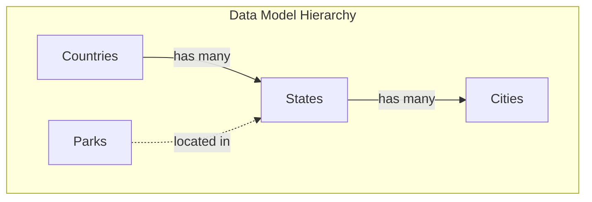
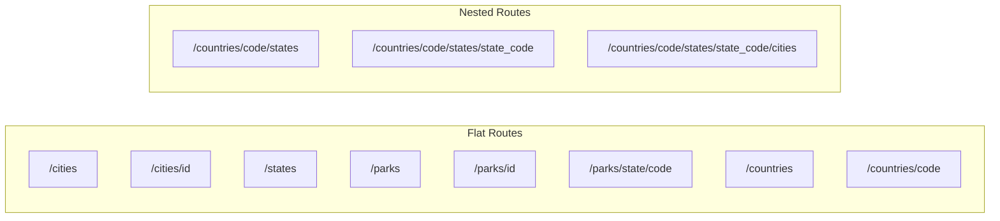
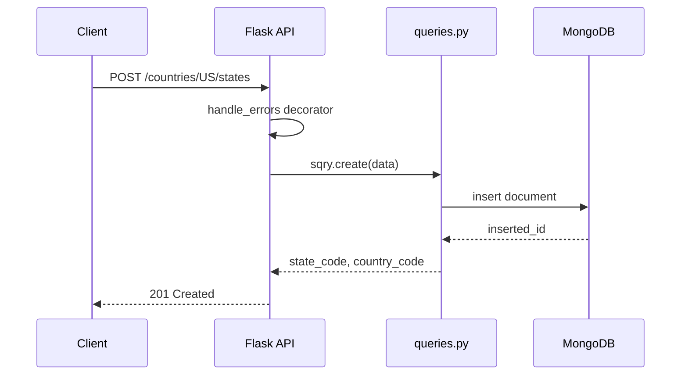
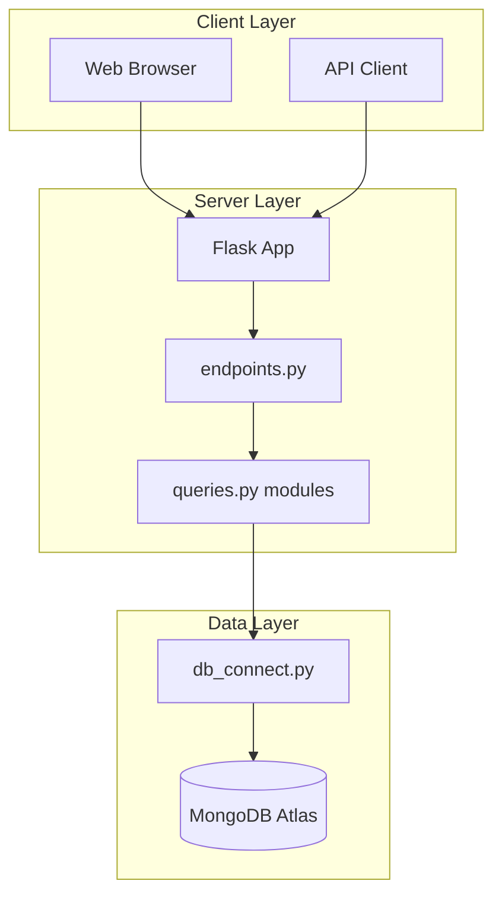

# Geographic Data API - Database & Architecture Documentation

## Entity Hierarchy

---

## API Route Structure

---

## Complete Endpoint Reference

| Endpoint | GET | POST | PUT | DELETE |
|----------|-----|------|-----|--------|
| **Countries** |||||
| `/countries` | List all | Create | - | - |
| `/countries/{code}` | Get one | - | Update | Delete |
| `/countries/{code}/states` | List states | Create state | - | - |
| `/countries/{code}/states/{state}` | Get state | - | Update | Delete |
| `/countries/{code}/states/{state}/cities` | List cities | Create city | - | - |
| **Cities (flat)** |||||
| `/cities` | List all | - | - | - |
| `/cities/{id}` | Get one | - | Update | Delete |
| **States (flat - search only)** |||||
| `/states?country_code=X&state_code=Y` | Filter/search | - | - | - |
| **Parks** |||||
| `/parks` | List all | Create | - | - |
| `/parks/{id}` | Get one | - | Update | Delete |
| `/parks/state/{code}` | By state | - | - | - |
| **Utility** |||||
| `/hello` | Health check | - | - | - |
| `/statistics` | DB stats | - | - | - |
| `/endpoints` | List routes | - | - | - |
| `/delete-all-data` | - | - | - | Wipe DB |

---

## Request Flow

---

## Design Decisions

| Aspect | Implementation |
|--------|----------------|
| **Create cities** | Only via nested route `/countries/{c}/states/{s}/cities` |
| **Create states** | Only via nested route `/countries/{c}/states` |
| **Create countries** | Flat route `POST /countries` |
| **Create parks** | Flat route `POST /parks` |
| **Search states** | Query params on `/states?country_code=X` |
| **Primary keys** | Countries: `code`, States: `country_code+state_code`, Cities/Parks: `_id` |

---

## Database Collections

| Collection | Primary Key | Example Document |
|------------|-------------|------------------|
| `countries` | `code` | `{"code": "US", "name": "United States", "capital": "Washington D.C."}` |
| `states` | `country_code` + `state_code` | `{"country_code": "US", "state_code": "NY", "name": "New York"}` |
| `cities` | `_id` (ObjectId) | `{"name": "NYC", "state_code": "NY", "country_code": "US"}` |
| `parks` | `_id` (ObjectId) | `{"name": "Yellowstone", "state_code": "WY"}` |

---

## Data Flow Architecture

